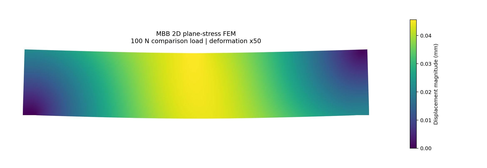
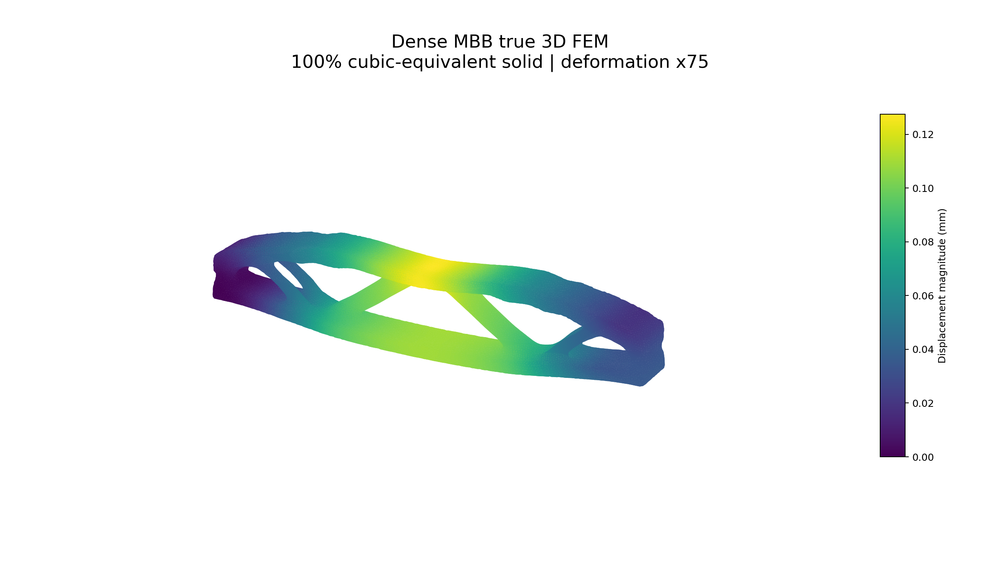
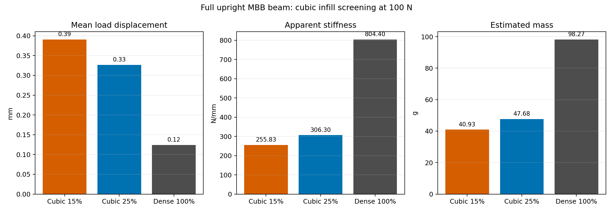
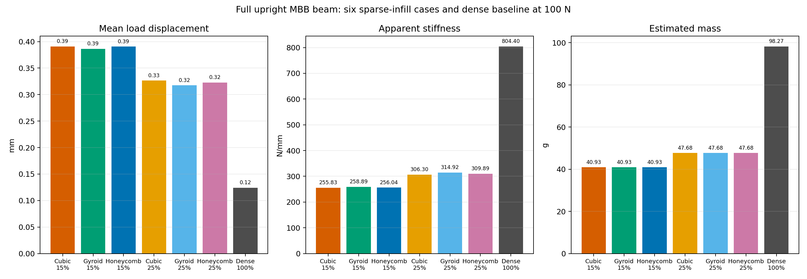

# MBB 3DP FEM

Finite-element validation of an MBB beam using DOLFINx, with a two-dimensional
plane-stress reference and a true three-dimensional tetrahedral solve of the
topology-optimized STL.

Implemented under the supervision of
[@libishm1](https://github.com/libishm1), **Libish Murugesan**
([ORCID 0009-0004-3238-4202](https://orcid.org/0009-0004-3238-4202)),
at the **CM-ITAD Lab**, as part of the **SURE program at Alfaisal
University**.

## Included FEM Models

### 2D DOLFINx reference

`src/fem/mbb_2d_dolfinx.py` solves the `210 x 40 mm` beam envelope using:

- two-dimensional plane-stress elasticity;
- the physical `24 mm` beam thickness;
- first-order triangular elements;
- a pinned left bearing patch and vertical roller constraint on the right;
- a distributed `100 N` top-midspan load;
- reaction, compliance, energy-identity and stress checks.



### True 3D DOLFINx model

`src/fem/mbb_3d_dolfinx.py`:

- imports the validated watertight source `raw/meshes/original-mesh.stl`;
- reconstructs its closed surface with Gmsh;
- generates a conforming tetrahedral volume mesh;
- solves full three-component 3D linear elasticity;
- applies finite 3D support and loading patches;
- calculates displacement, von Mises stress, reactions, compliance, strain
  energy, mass and mesh-quality metrics;
- writes XDMF/HDF5 fields locally and creates a 3D displacement plot.

At `100%` infill density, a cubic slicer pattern contains no intentional void
phase. The baseline is therefore modeled as **dense isotropic PLA**, referred
to as the `100% cubic-equivalent solid`.



### Full-upright cubic infill cases

`src/fem/mbb_3d_cubic_shell_core.py` applies the same full upright
`original-mesh.stl` to the `15%`, `25%`, and dense `100%` comparisons. The
half-beam orientation found in the 25% slicer archive is not used as FEM
geometry.

The archived G-code confirms cubic toolpaths with projected line pitches of
`8.142 mm` at 15% and `4.885 mm` at 25%. Sparse cases use a volume-matched
dense shell and a homogenized cubic core with the screening law
`E_core/E_PLA = relative_density^2`.



The compiled technical report is available in:

- [`outputs/reports/full_upright_cubic_fem_report.pdf`](outputs/reports/full_upright_cubic_fem_report.pdf)
- [`outputs/reports/full_upright_cubic_fem_report.docx`](outputs/reports/full_upright_cubic_fem_report.docx)

### Six sparse-infill cases

`src/fem/mbb_3d_pattern_shell_core.py` extends the same full-upright model to:

- cubic at 15% and 25%;
- gyroid at 15% and 25%;
- honeycomb at 15% and 25%.

The pattern correction is calculated from the archived G-code axial
fourth-orientation moment and normalized to cubic at each density. This keeps
the accepted cubic baseline unchanged while providing a traceable
pattern-specific screening comparison.



See
[`outputs/fem/all_patterns_full_upright_comparison/validation.md`](outputs/fem/all_patterns_full_upright_comparison/validation.md)
for the complete assumptions, numerical checks, and validation boundary.

Compiled report:

- [`outputs/reports/full_upright_all_infill_fem_report.pdf`](outputs/reports/full_upright_all_infill_fem_report.pdf)
- [`outputs/reports/full_upright_all_infill_fem_report.docx`](outputs/reports/full_upright_all_infill_fem_report.docx)

Appendix A of the report includes the inspected `.3mf` sparse-infill layer
figures for every pattern and density. Appendix B pairs the true 3D
tetrahedral mesh and deformed FE displacement plot for all six sparse cases
and the dense 100% baseline. The main results section includes a seven-case
engineering comparison matrix with stiffness, mass, efficiency, and ranking.

## Validated Results

Material assumptions:

```text
Young's modulus: 3.0 GPa
Poisson ratio:   0.35
PLA density:     1240 kg/m3
Load:            100 N
```

| Quantity | 2D plane stress | 3D topology STL |
|---|---:|---:|
| Elements | 10,752 triangles | 134,566 tetrahedra |
| Mean load displacement | -0.04400 mm | -0.12432 mm |
| Maximum displacement | 0.04560 mm | 0.12749 mm |
| Maximum von Mises stress | 1.998 MPa | 2.457 MPa |
| Total vertical reaction | 99.999998 N | 99.999998 N |
| Equilibrium relative error | 1.60e-8 | 1.63e-8 |
| Energy identity relative error | 1.03e-10 | 2.43e-11 |

The 3D displacement result was checked at nominal mesh sizes of `4.0`, `3.0`
and `2.4 mm`. The two finest results differed by `1.06%`, satisfying the
provisional `3%` displacement-convergence criterion. Absolute peak stress
changed by approximately `6.03%` and remains mesh-sensitive.

See:

- `outputs/fem/2d_plane_stress/results.json`
- `outputs/fem/3d_cubic_100/results.json`
- `outputs/fem/3d_cubic_100/validation.md`
- `outputs/fem/cubic_full_upright_comparison/comparison.json`
- `outputs/gcode_validation/cubic_15/gcode_cubic_validation.json`
- `outputs/gcode_validation/cubic_25/gcode_cubic_validation.json`

Sparse full-upright screening results at the accepted `2.4 mm` mesh:

| Case | Mean load displacement | Apparent stiffness | Estimated mass |
|---|---:|---:|---:|
| Cubic 15% | 0.39089 mm | 255.83 N/mm | 40.93 g |
| Cubic 25% | 0.32648 mm | 306.30 N/mm | 47.68 g |
| Dense 100% | 0.12432 mm | 804.40 N/mm | 98.27 g |

Refining the sparse-case mesh from `3.0` to `2.4 mm` changed mean load
displacement by `3.53%` for 15% and `2.29%` for 25%.

## Run With Docker

Build the pinned project environment from PowerShell:

```powershell
docker build -t mbb-3dp-fem .
```

Run the 2D reference:

```powershell
docker run --rm `
  -v "${PWD}:/workspace" `
  mbb-3dp-fem `
  python src/fem/mbb_2d_dolfinx.py --load-n 100
```

Run the true 3D dense baseline:

```powershell
docker run --rm `
  -v "${PWD}:/workspace" `
  mbb-3dp-fem `
  python src/fem/mbb_3d_dolfinx.py `
    --stl raw/meshes/original-mesh.stl `
    --mesh-size-mm 2.4 `
    --load-n 100 `
    --plot-scale 75
```

Run a full-upright sparse cubic case:

```powershell
docker run --rm `
  -v "${PWD}:/workspace" `
  mbb-3dp-fem `
  python src/fem/mbb_3d_cubic_shell_core.py `
    --stl raw/meshes/original-mesh.stl `
    --infill-density 0.15 `
    --infill-pitch-mm 8.141627 `
    --mesh-size-mm 2.4 `
    --load-n 100
```

Large generated `.msh`, `.h5` and `.xdmf` files are intentionally excluded
from Git. Each new run is written to a timestamped directory under
`outputs/fem/`.

## Validation Boundary

These results are numerical, small-strain linear-elastic predictions. They do
not establish physical failure load, inter-layer strength, fatigue life,
certification, or a safety factor. Printed-coupon calibration is required
before using the material model for physical design decisions.

## References

- [DOLFINx documentation](https://docs.fenicsproject.org/dolfinx/main/python/)
- [DOLFINx elasticity demonstration](https://docs.fenicsproject.org/dolfinx/main/python/demos/demo_elasticity.html)
- [DOLFINx Gmsh interface](https://docs.fenicsproject.org/dolfinx/main/python/generated/dolfinx.io.gmsh.html)
- Wu, J., Clausen, A. and Sigmund, O., "Minimum compliance topology
  optimization of shell-infill composites for additive manufacturing,"
  *Computer Methods in Applied Mechanics and Engineering*, 326, 358-375,
  2017. https://doi.org/10.1016/j.cma.2017.08.018
